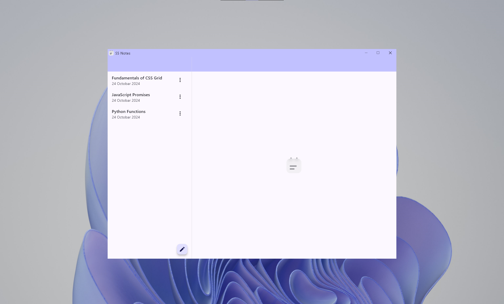
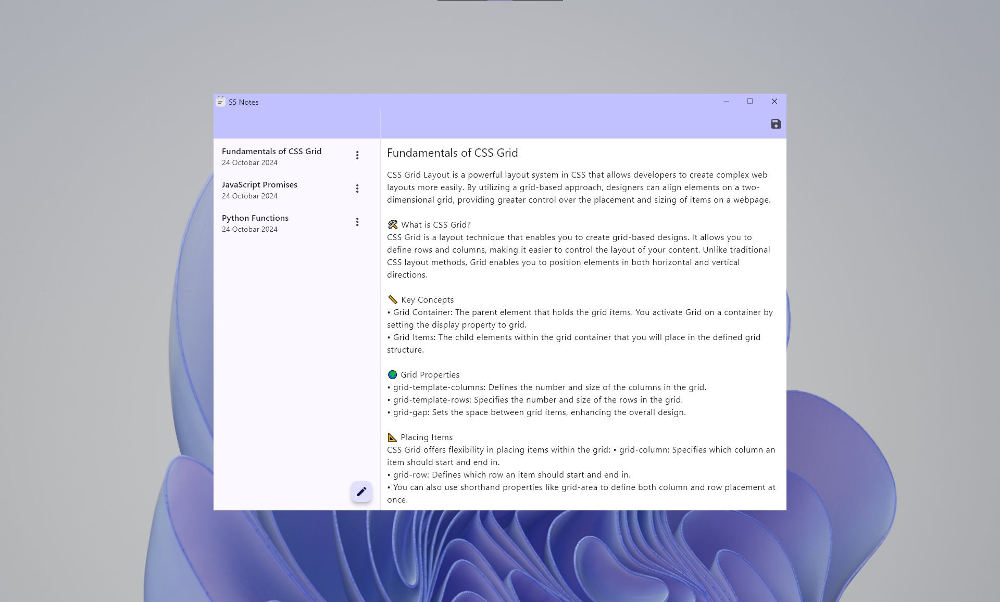

# 📒 S5 Notes

S5 Notes is a **simple** and **easy-to-use** note-taking app designed with a **modern, dynamic theme** that adapts to your device’s color scheme. Built with usability and aesthetics in mind, S5 Notes aims to be your go-to app for jotting down thoughts, to-do lists, and ideas, with more exciting features on the way!

## ✨ Features

- **Dynamic Theme Adaptation**  
  S5 Notes automatically adjusts to your device's light or dark mode, providing a seamless user experience.

- **Simple & Intuitive Design**  
  With a clean interface, S5 Notes makes it easy for you to organize and manage your notes without clutter.

- **Lightning Fast**  
  Experience a fast and smooth performance that lets you take notes on the fly, with minimal loading time.

- **Cross-Platform Support**  
  Available for desktop and mobile platforms.

## 🤝 Contributions

We welcome contributions! If you find any issues or have ideas for improvements, feel free to submit a pull request or open an issue.

## 📧 Contact

For any questions or suggestions, feel free to reach out at s5sajidyt@gmail.com.

Follow me on [Instagram](https://instagram.com/s5sajid) | [YouTube](https://youtube.com/@s5sajid)